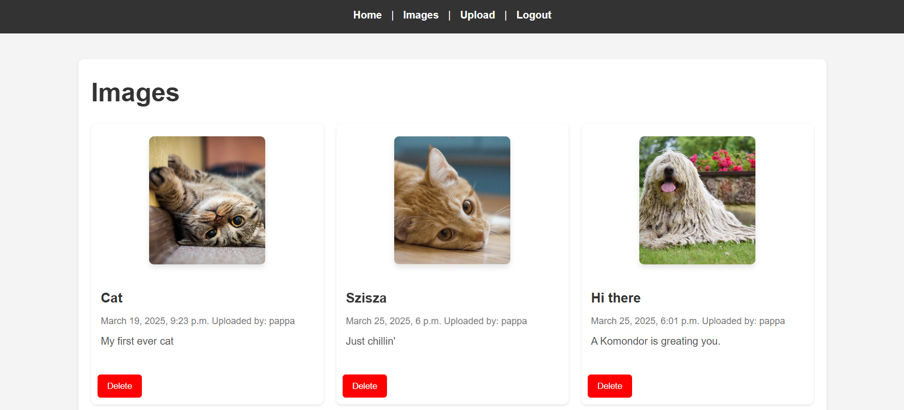

# Album

[](https://github.com/B4nd1/cicd/actions)

### Install dependencies
```
pip install -r requirements.txt
```

### Run
```
python manage.py runserver
```

```python
print("Hello World")
```

# Functions of the app 
* Login, Register
* See details of the picture
* Upload pictures
* Delete pictures
* 

# Screenshots



# Useful Openshift commands
```
oc new-app https://github.com/B4nd1/felho_fenykepalbum --strategy=docker

oc delete svc felhofenykepalbum
oc delete bc felhofenykepalbum
oc delete deployments.apps felhofenykepalbum
```